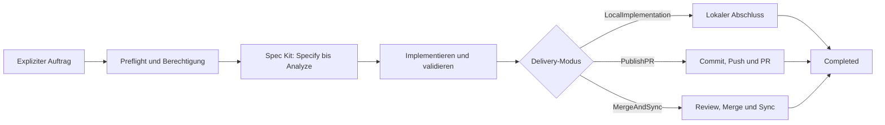

# Autonomous Run Governance

Permission-bounded, evidence-first governance for one explicitly delegated
autonomous Spec Kit run.

Version `0.3.1` | Priority `70` | Spec Kit `>=0.8.3`

## Deutsch

### Wofuer ist dieses Preset gedacht?

Dieses Preset fuehrt **einen** Spec-Kit-Feature-Lauf kontrolliert von der
Vorbereitung bis zum belegbaren Abschluss. Es verbindet:

- ausdrueckliche Berechtigungen statt stiller Annahmen,
- reproduzierbare Specify-, Clarify-, Plan-, Tasks- und Analyze-Phasen,
- einen maschinenlesbaren Run-State,
- kooperatives Stoppen und idempotentes Fortsetzen,
- pruefbare Acceptance-Gates fuer den exakten aktuellen Head,
- einen kontrollierten lokalen oder remote Closeout,
- retrospektives Lernen ohne automatische Scope-Erweiterung.

Die Installation startet keinen Lauf und erteilt keine Commit-, Push-, Merge-,
Bypass-, Secret- oder Provider-Administrationsrechte.

### Ablauf im Ueberblick



**Textalternative DE:** Ein ausdruecklicher Auftrag fuehrt zuerst durch
Preflight und Berechtigungspruefung. Danach folgen die Spec-Kit-Phasen,
Implementierung und Validierung. Der aktuelle Auftrag bestimmt genau einen
Delivery-Modus. Erst wenn dessen Abschlussbedingungen und die finale
Validierung erfuellt sind, ist der Lauf `Completed`.

**Text alternative EN:** An explicit instruction first passes repository and
authority preflight. The Spec Kit phases, implementation, and validation
follow. Current authority selects exactly one delivery mode. The run becomes
`Completed` only after that mode's closeout conditions and final validation
have succeeded.

### In fuenf Minuten starten

1. Preset installieren:

   ```bash
   specify preset add \
     --from https://github.com/hindermath/spec-kit-preset-autonomous-run-governance/archive/refs/tags/v0.3.1.zip \
     --priority 70
   ```

2. Installation pruefen:

   ```bash
   specify preset info autonomous-run-governance
   specify preset resolve autonomous-run-readiness-checklist-template
   ```

3. Einen eindeutig begrenzten lokalen Lauf delegieren:

   ```text
   /speckit.autonomous Implementiere Feature 042 vollstaendig.
   Delivery-Modus: LocalImplementation.
   Keine Commits, Pushes, PRs, Merges oder Bypasses.
   ```

4. Zustand jederzeit read-only abfragen:

   ```text
   /speckit.autonomous-status
   ```

Fuer einen absichtlichen Halt wird `/speckit.autonomous-stop` verwendet. Ein
bewusst pausierter Lauf wird ausschliesslich mit
`/speckit.autonomous-resume` fortgesetzt.

### Wann Preset 7 und wann Preset 8?

Preset 7 ist fuer genau einen autonomen Feature-Lauf zustaendig. Mehrere
isolierte Worker, Kampagnen-DAGs, gemischte Runner-Profile oder eine geordnete
Mehr-PR-Konsolidierung benoetigen zusaetzlich
[`parallel-autonomous-run-governance`](https://github.com/hindermath/spec-kit-preset-parallel-autonomous-run-governance).
Preset 8 baut auf diesem Preset auf und ersetzt seine Worker-Governance nicht.

### Handbuch

| Kapitel | Inhalt |
|---|---|
| [Dokumentationsstart](docs/README.md) | Rollenbasierter Wegweiser |
| [Erster Lauf](docs/getting-started.md) | Installation, Readiness und erster sicherer Lauf |
| [Berechtigung und Delivery](docs/authority-and-delivery.md) | Delivery-Modi und Autorisierungsgrenzen |
| [Lebenszyklus und Operationen](docs/lifecycle-and-operations.md) | Status, Stop, Resume und Retrospektive |
| [Evidence und Closeout](docs/evidence-and-closeout.md) | Gates, Exact Head, Review und Abschluss |
| [Recovery und Fehlersuche](docs/recovery-and-troubleshooting.md) | Unterbrechung, Drift und Blocker |
| [Kompatibilitaet](docs/compatibility.md) | Versionen, Schemas und Upgrade-Regeln |

## English

### What is this preset for?

This preset governs **one** Spec Kit feature run from preparation to a
verifiable closeout. It combines:

- explicit authority instead of silent assumptions,
- reproducible Specify, Clarify, Plan, Tasks, and Analyze phases,
- machine-readable run state,
- cooperative stop and idempotent resume,
- acceptance gates bound to the exact current head,
- controlled local or remote closeout,
- retrospective learning without automatic scope expansion.

Installing the preset does not start a run or grant commit, push, merge,
bypass, secret, or provider-administration authority.

### Five-minute start

1. Install the preset:

   ```bash
   specify preset add \
     --from https://github.com/hindermath/spec-kit-preset-autonomous-run-governance/archive/refs/tags/v0.3.1.zip \
     --priority 70
   ```

2. Verify the installation:

   ```bash
   specify preset info autonomous-run-governance
   specify preset resolve autonomous-run-readiness-checklist-template
   ```

3. Delegate one bounded local run:

   ```text
   /speckit.autonomous Implement feature 042 completely.
   Delivery mode: LocalImplementation.
   Do not commit, push, open a PR, merge, or bypass policy.
   ```

4. Inspect state at any time without changing it:

   ```text
   /speckit.autonomous-status
   ```

Use `/speckit.autonomous-stop` for a deliberate pause. Resume a deliberately
paused run only through `/speckit.autonomous-resume`.

### Preset 7 or Preset 8?

Preset 7 governs one autonomous feature run. Multiple isolated workers,
campaign DAGs, mixed runner profiles, or ordered multi-PR consolidation also
require
[`parallel-autonomous-run-governance`](https://github.com/hindermath/spec-kit-preset-parallel-autonomous-run-governance).
Preset 8 builds on this preset and does not replace worker governance.

### Manual

| Chapter | Subject |
|---|---|
| [Documentation home](docs/README.md) | Role-based documentation map |
| [First run](docs/getting-started.md) | Installation, readiness, and first safe run |
| [Authority and delivery](docs/authority-and-delivery.md) | Delivery modes and authority boundaries |
| [Lifecycle and operations](docs/lifecycle-and-operations.md) | Status, stop, resume, and retrospective |
| [Evidence and closeout](docs/evidence-and-closeout.md) | Gates, exact head, review, and completion |
| [Recovery and troubleshooting](docs/recovery-and-troubleshooting.md) | Interruption, drift, and blockers |
| [Compatibility](docs/compatibility.md) | Versions, schemas, and upgrade rules |

## Safety summary

- Ambiguous remote authority always falls back to `LocalImplementation`.
- Status is read-only and grants no authority.
- Stop is cooperative and never an implicit process kill.
- A stored delivery mode records history; it is not current permission.
- Missing, stale, or contradictory evidence blocks remote closeout.
- `Completed` requires every applicable closeout field and final validation.

## License

MIT
