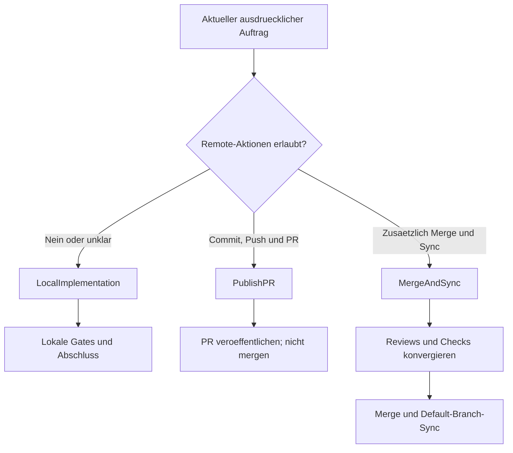

# Berechtigung und Delivery / Authority and Delivery

[Handbuch / Manual](README.md) | [Lebenszyklus / Lifecycle](lifecycle-and-operations.md)

## Delivery-Entscheidung / Delivery decision

**Textalternative DE:** Bei fehlender oder unklarer Remote-Berechtigung gilt
immer `LocalImplementation`. `PublishPR` erlaubt zusaetzlich Commit, Push und
PR, aber keinen Merge. `MergeAndSync` benoetigt ausdrueckliche aktuelle
Merge-Berechtigung und alle Review-, Check- und Synchronisationsnachweise.

**Text alternative EN:** Missing or ambiguous remote authority always selects
`LocalImplementation`. `PublishPR` additionally permits commit, push, and PR
publication, but not merge. `MergeAndSync` requires explicit current merge
authority plus all review, check, and synchronization evidence.

## Deutsch

### Berechtigung wird nicht vererbt

Eine allgemeine Bitte wie "arbeite autonom" erteilt keine stillen Rechte fuer:

- Commit oder Push,
- Erstellen oder Aktualisieren eines Pull Requests,
- Merge oder Branch-Loeschung,
- Admin- oder Ruleset-Bypass,
- Abbruch fremder Prozesse oder Workflows,
- Lesen oder Aendern von Secrets,
- Provider- oder Repository-Administration.

Jede Berechtigung wird vor der betroffenen Operation erneut gegen den aktuellen
Auftrag geprueft. Ein im Run-State gespeicherter Delivery-Modus ist historische
Evidence, keine fortdauernde Erlaubnis.

### `LocalImplementation`

Der Default bei Unklarheit. Erlaubt sind nur lokale Aenderungen und lokale
Validierung im abgegrenzten Arbeitsbereich. Der Index wird nicht ungefragt
veraendert; fuer Kandidatenpruefungen wird eine per-Datei- oder temporaere
Indexmethode verwendet.

Abschluss:

- relevante Tasks und lokale Gates abgeschlossen,
- Run-State und Evidence aktuell,
- keine Remote-Aktion,
- exakte lokale Restarbeiten benannt.

### `PublishPR`

Zusaetzlich erlaubt:

- nur beabsichtigte Dateien stagen,
- Kandidat mit `git diff --cached --check` pruefen,
- Commit erstellen und Branch pushen,
- Pull Request erstellen oder aktualisieren.

Nicht enthalten sind Merge, Bypass und Branch-Cleanup nach Merge.

### `MergeAndSync`

Dieser Modus umfasst `PublishPR` und danach:

- aktuelle Reviews und erforderliche Checks,
- Exact-Head-Evidence fuer den gemergten Kandidaten,
- keine offenen handlungsrelevanten Threads,
- Merge nach Repository-Policy,
- Default-Branch per Fast-Forward synchronisieren,
- deklarierte Post-Merge-Arbeiten und finale Validierung.

Ein gruen benannter Workflow oder ein Admin-Bypass ersetzt keinen technischen
Nachweis.

### Eng begrenzter Bypass

Ein Bypass gilt nur, wenn der Owner ihn fuer den konkreten PR und die konkrete
Policy ausdruecklich autorisiert. Er darf niemals technische Fehler, fehlende
Reviews oder falsche Heads ueberdecken. Autorisierer, Umfang, Grund und
verbleibendes Risiko gehoeren in die Evidence.

## English

### Authority is not inherited

A general request to "work autonomously" does not silently grant authority to:

- commit or push,
- create or update a pull request,
- merge or delete branches,
- bypass admin or ruleset controls,
- cancel unrelated processes or workflows,
- read or modify secrets,
- administer providers or repositories.

Authority is rechecked immediately before the affected operation. A delivery
mode stored in run state is historical evidence, not continuing permission.

### `LocalImplementation`

This is the default when authority is unclear. Only bounded local edits and
local validation are permitted. The existing index is preserved; candidate
validation uses a per-file or temporary-index equivalent.

Completion requires current tasks, gates, run state, evidence, and an exact
account of remaining local work. It performs no remote action.

### `PublishPR`

This mode additionally permits staging only intended files, validating the
candidate, committing, pushing, and creating or updating a pull request. It
does not include merge, bypass, or post-merge branch cleanup.

### `MergeAndSync`

This mode includes `PublishPR`, then current reviews and checks, exact-head
evidence, no actionable review thread, policy-compliant merge, fast-forward
default-branch synchronization, declared post-merge work, and final
validation.

A green workflow name or an admin bypass is not technical evidence.

### Narrow bypass authority

A bypass applies only when the owner explicitly authorizes it for the concrete
pull request and policy. It must never hide technical failure, missing review,
or a wrong head. Record authorizer, scope, rationale, and residual risk.
