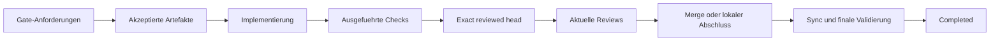

# Evidence und Closeout / Evidence and Closeout

[Handbuch / Manual](README.md) | [Recovery / Recovery](recovery-and-troubleshooting.md)

## Evidence-Kette / Evidence chain



**Textalternative DE:** Acceptance-Gates werden vor der Implementierung
deklariert und an akzeptierte Artefakte gebunden. Ausgefuehrte Checks muessen
den exakten reviewten Head, den realen Befehl und Runner belegen. Danach folgen
aktuelle Reviews, der erlaubte Delivery-Abschluss, Synchronisation und finale
Validierung. Fehlende oder widerspruechliche Evidence unterbricht die Kette.

**Text alternative EN:** Acceptance gates are declared before implementation
and bound to accepted artifacts. Executed checks must prove the exact reviewed
head, actual command, and runner. Current reviews, authorized delivery,
synchronization, and final validation follow. Missing or contradictory
evidence breaks the chain.

## Deutsch

### Anforderungen vor Implementierung

Das Gate-Requirements-Artefakt beschreibt fuer jedes Gate:

- `Applicable` oder `N/A`,
- erwartete Befehls- und Runner-Tokens,
- Begruendung und Re-Evaluierungs-Trigger bei `N/A`,
- Besitzer und Evidence-Pfad.

```bash
bash .specify/presets/autonomous-run-governance/scripts/validate-autonomous-gate-evidence.sh \
  --requirements specs/042-feature/autonomous-run-gate-requirements.json \
  --evidence /tmp/042-gate-evidence.json
```

```powershell
pwsh -NoProfile -File `
  .specify/presets/autonomous-run-governance/scripts/validate-autonomous-gate-evidence.ps1 `
  -RequirementsPath specs/042-feature/autonomous-run-gate-requirements.json `
  -EvidencePath /tmp/042-gate-evidence.json
```

### Exact-Head-Evidence

Vor einem Merge muss jede Primary-Evidence-Zeile zum vollstaendigen aktuellen
reviewten Head passen. Supplemental-Zeilen verweisen auf ihre Primary-Zeile.
Check-, Workflow- oder Job-Namen allein beweisen weder ausgefuehrte Befehle
noch Plattformen.

Exact-Head-Evidence bleibt waehrend der Merge-Entscheidung temporaer. Ein
Commit dieser Evidence wuerde einen neuen Head erzeugen und die eigene Aussage
ungueltig machen.

### Review-Grenze

Remote Closeout ist nur konvergiert, wenn:

- alle erforderlichen Checks fuer den exakten Head erfolgreich sind,
- keine aktuelle Change Request vorliegt,
- kein handlungsrelevanter Review-Thread offen ist,
- ein nicht verfuegbarer Reviewer als fehlend und nicht als Zustimmung gilt,
- die aktuelle Merge-Berechtigung erneut bestaetigt ist.

### Abschluss

`Completed` ist erst zulaessig, wenn der gewaehlte Delivery-Modus terminal ist,
der Default-Branch bei Remote-Delivery synchronisiert wurde, deklarierte
Post-Merge-Arbeiten abgeschlossen sind und die finale Validierung `Completed`
meldet.

## English

### Requirements before implementation

The gate-requirements artifact records `Applicable` or `N/A`, required command
and runner tokens, rationale and re-evaluation trigger for `N/A`, owner, and
evidence path for every gate.

Use the installed Bash or PowerShell validator before remote closeout. A
successful validator exit proves contract consistency, but grants no remote
authority.

### Exact-head evidence

Before merge, every primary evidence row must match the full current reviewed
head. Supplemental rows reference their primary row. Check, workflow, or job
names alone do not prove executed commands or platforms.

Keep exact-head evidence temporary during the merge decision. Committing it
would create a new head and invalidate its own claim.

### Review boundary

Remote closeout converges only when all required checks pass for the exact
head, no current change request or actionable review thread remains, an
unavailable reviewer is treated as missing rather than approval, and current
merge authority is confirmed.

### Completion

`Completed` is valid only when the selected delivery mode is terminal, the
default branch is synchronized after remote delivery, declared post-merge work
is complete, and final validation reports `Completed`.
